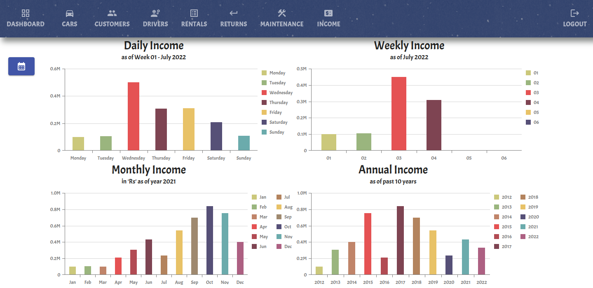

# Enterprise Level Application with Spring Web MVC and React JS

 

## Car_Rental_System

 

## Technology Stack :

- React JS
- Axios
- MUI Components
- DevExtreme Charts
- Spring Web MVC
- Spring Data JPA
- Apache Tomcat Web Container
- Maven
- Hibernate
- MySQL
- SweetAlerts

  

   
   
   
   
   
   
   
   
   
   
